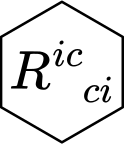

<!-- README.md is generated from README.Rmd. Please edit that file -->

# ricci <a href="https://lschneiderbauer.github.io/ricci/"></a>

<!-- badges: start -->

[](https://github.com/lschneiderbauer/ricci/actions/workflows/R-CMD-check.yaml)
[](https://app.codecov.io/gh/lschneiderbauer/ricci)
[](https://CRAN.R-project.org/package=ricci)
[](https://lifecycle.r-lib.org/articles/stages.html#experimental)

<!-- badges: end -->

The goal of {ricci} is to provide a *compact*[^1] R interface for
performing [tensor
calculations](https://en.wikipedia.org/wiki/Ricci_calculus). This is
achieved by allowing (upper and lower) index labeling of R’s `array` and
making use of Ricci calculus conventions to *implicitly* trigger
**contractions** and diagonal subsetting. Explicit tensor operations,
such as **addition, subtraction and multiplication of tensors** via the
standard operators (`*`, `+`, `-`, `/`, `==`), **raising and lowering
indices**, taking **symmetric** or **antisymmetric tensor parts**, as
well as the **Kronecker product** are available. Common tensors like the
Kronecker delta, Levi Civita epsilon, certain metric tensors, the
Christoffel symbols, the Riemann as well as Ricci tensors are provided.
The **covariant derivative** of tensor fields with respect to any metric
tensor can be evaluated. An effort was made to provide the user with
meaningful error messages.

{ricci} uses the [calculus](https://calculus.eguidotti.com/) package
(Guidotti 2022) behind the scenes to perform calculations and provides
an alternative interface to a subset of its functionality. Notably,
{[calculus](https://calculus.eguidotti.com/)} also supports symbolic
calculations which also enables {ricci} to do the same. Symbolic
expressions are optionally simplified when the
[Ryacas](https://r-cas.github.io/ryacas/) package is installed.

## Installation

You can install the development version of ricci from
[GitHub](https://github.com/) with:

``` r
# install.packages("pak")
pak::pak("lschneiderbauer/ricci")
```

## Example

The central object is R’s `array`. Adding index slot labels allows us to
perform common tensor operations implicitly. After the desired
calculations have been carried out we can remove the labels to obtain an
ordinary `array`.

The following (admittedly very artificial) example shows how to express
the contraction of two tensors, and subsequent symmetrization and
diagonal subsetting. For demonstration purposes we use an arbitrary
array of rank 3.

``` r
library(ricci)

# numeric data
a <- array(1:(2^3), dim = c(2, 2, 2))

# create labeled array (tensor)
(a %_% .(i, j, k) *
  # mutliply with a labeled array (tensor) and raise index i and k
  a %_% .(i, l, k) |> r(i, k, g = g_mink_cart(2))) |>
  # * -i and +i as well as -k and +k dimension are implictely contracted
  # the result is a tensor of rank 2
  sym(j, l) |> # symmetrize over i and l
  subst(l -> j) |> # rename index and trigger diagonal subsetting
  as_a(j) # we unlabel the tensor with index order (j)
#> [1] 8 8
```

The same instructions work for a symbolic array:

``` r
# enable optional simplfying procedures
# (takes a toll on performance)
options(ricci.auto_simplify = TRUE)

# symbolic data
a <- array(paste0("a", 1:(2^3)), dim = c(2, 2, 2))

(a %_% .(i, j, k) *
  # mutliply with a labeled array (tensor) and raise index i and k
  a %_% .(i, l, k) |> r(i, k, g = g_mink_cart(2))) |>
  # * -i and +i as well as -k and +k dimension are implictely contracted
  # the result is a tensor of rank 2
  sym(j, l) |> # symmetrize over i and l
  subst(l -> j) |> # rename index and trigger diagonal subsetting
  as_a(j) # we unlabel the tensor with index order (j)
#> [1] "a1^2+a6^2-(a5^2+a2^2)" "a3^2+a8^2-(a7^2+a4^2)"
```

Another main feature is the covariant derivative of symbolic arrays. The
following examples calculate the Hessian matrix as well as the Laplacian
of the scalar function $\sin(r)$ in spherical coordinates in three
dimensions.

$$D_{ik} = \nabla_i \nabla_k \sin(r)$$

``` r
covd("sin(r)", .(i, k), g = g_eucl_sph(3)) |>
  simplify()
#> <Labeled Array> [3x3] .(-i, -k)
#>      [,1]      [,2]       [,3]                 
#> [1,] "-sin(r)" "0"        "0"                  
#> [2,] "0"       "r*cos(r)" "0"                  
#> [3,] "0"       "0"        "r*sin(ph1)^2*cos(r)"
```

$$\Delta \sin(r) = \nabla_i \nabla^i \sin(r)$$

``` r
covd("sin(r)", .(i, +i), g = g_eucl_sph(3)) |>
  simplify()
#> <Scalar>
#> [1] "(2*cos(r)-r*sin(r))/r"
```

The covariant derivative can not only be taken from scalars, but general
indexed tensors, as the following example, involving the curl of $a$,
shows.

$$\left(\nabla \times a\right)^i = \varepsilon^{i}_{\;jk} \nabla^j a^k$$

``` r
g <- g_eucl_sph(3)
a <- c(0, 1, 0)

(a %_% .(+k) |> covd(.(+j), g = g) *
  e(i, j, k) |> r(i, g = g)) |>
  simplify()
#> <Labeled Array> [3] .(+i)
#> [1] "0"                  "0"                  "2/(r^3*sin(ph1)^2)"
```

For more details, see `vignette("ricci", package = "ricci")`. For more
information about how to use tensor fields and the covariant derivative,
see `vignette("tensor_fields", package = "ricci")`.

<div id="refs" class="references csl-bib-body hanging-indent"
entry-spacing="0">

<div id="ref-guidotti2022" class="csl-entry">

Guidotti, Emanuele. 2022. “**Calculus**: High-Dimensional Numerical and
Symbolic Calculus in *R*.” *Journal of Statistical Software* 104 (5).
<https://doi.org/10.18637/jss.v104.i05>.

</div>

</div>

[^1]: By compact interface, we mean an interface that is concise and
    non-verbose. The author is of the opinion that the less we need to
    write in order to express an intent, the less likely are we to make
    mistakes.
